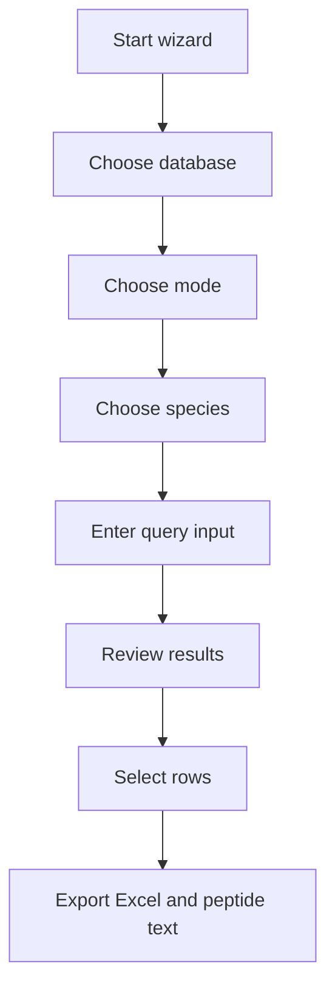
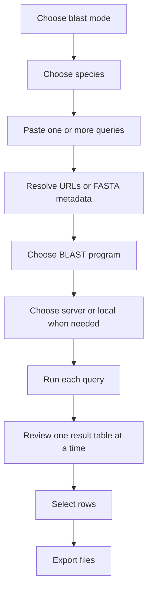
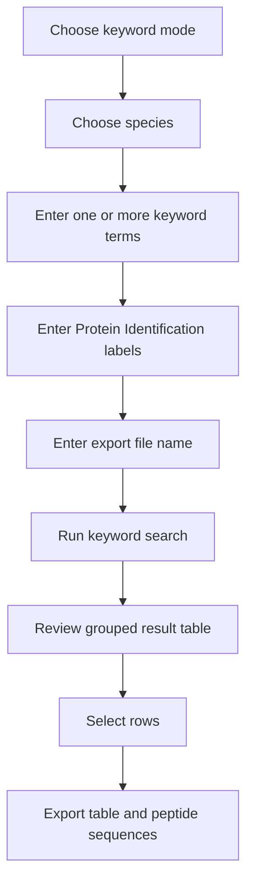

# phytozome GO

`phytozome GO` is a cross-platform interactive CLI for two closely related jobs:

- searching `Phytozome` genomes with keyword or BLAST workflows
- searching `lemna.org` releases with a matching wizard-style workflow

The program is designed for real biological work where you often need to move from one known gene or protein to a shortlist of homologs, review rows interactively, and export both a table and peptide sequences without hand-copying between websites.


## What This Tool Is For

This tool is useful when you are doing work like:

- starting from `AT4G32410.1` in *Arabidopsis thaliana* and finding homologs in duckweed
- searching several cellulose synthase genes together and exporting one result package per query
- searching a species by keyword, selecting good candidate genes, then copying the generated link list into BLAST mode
- switching between `Phytozome` and `lemna.org` without learning two different command-line interfaces

The wizard keeps the same broad experience across both databases:

- choose database
- choose mode
- choose species
- provide query input
- review results
- select rows
- export Excel and peptide text files

## Supported Databases

### `phytozome`

Use this when you want the original Phytozome-backed workflow.

Typical use cases:

- exact gene ID search such as `AT5G44030`
- transcript or protein lookups from Phytozome report URLs
- BLAST against a selected Phytozome proteome/genome

### `lemna`

Use this when you want the `lemna.org` workflow.

Important behavior:

- species come from `https://www.lemna.org/download/`
- the homepage clone list is only used to mark official clones
- keyword search is backed by release `GFF3`, `AHRD`, and FASTA assets
- BLAST will use server-side paths when reliable, then fall back to local BLAST when needed

## Install And Run

Download the release asset for your platform from GitHub Releases, extract it, and run the binary in a normal terminal.

Examples:

```text
Windows:
phytozome-go.exe

Linux:
./phytozome-go_linux_amd64

macOS Intel:
./phytozome-go_darwin_amd64

macOS Apple Silicon:
./phytozome-go_darwin_arm64
```

The wizard starts immediately. You do not need to pass subcommands.

## Files The Program Creates

The program keeps all runtime artifacts next to the executable so nothing is scattered around your system.

- `output/`
  - exported `.xlsx`
  - exported `.txt`
  - generated `_list.txt`
  - detailed run reports
- `.cache/`
  - Phytozome persistent caches
  - lemna release caches
  - local BLAST databases and downloaded FASTA

If you choose an extra folder name during batch BLAST export, that folder is created inside `output/`.

## Language Switching

The program supports English, Chinese, and Japanese.

### Runtime language switching

At any prompt, type one of these:

```text
lang=en
lang=cn
lang=jp
```

This changes the following prompts immediately.

### Language from executable name

You can also choose the startup language by renaming the executable:

```text
phytozome-go-en.exe
phytozome-go-cn.exe
phytozome-go-jp.exe
```

If no language suffix is present, the default is English.

## Global Navigation Commands

These commands are available throughout the wizard and are shown on screen:

- `back` = return to the previous page
- `spawn` = return to mode selection
- `lobby` = return to database selection
- `exit` = quit the wizard

This matters when you are several steps deep and want to change only one decision without restarting the whole session.

Example:

- you selected `lemna`
- then chose `blast`
- then selected the wrong species
- type `back` to return to species selection

Example:

- you started in `blast` mode but decide keyword search is more appropriate
- type `spawn` to jump back to mode selection

## High-Level Workflow



## Step-By-Step Tutorial

This section explains the wizard the way a real user experiences it.

## Step 1: Choose Database

You first choose:

- `phytozome`
- `lemna`

How to decide:

- choose `phytozome` when your target species and identifiers are in Phytozome
- choose `lemna` when your target species is one of the duckweed or related releases hosted by `lemna.org`

Real example:

- you have an *Arabidopsis* gene link and want to search homologs in *Spirodela polyrhiza 9509*
- choose `lemna`
- the query sequence can still come from the Phytozome URL, but the search target will be the selected lemna species

## Step 2: Choose Mode

You then choose:

- `blast`
- `keyword`

### When to use `blast`

Use BLAST when you already have a sequence or a precise source record.

Typical inputs:

- plain protein sequence
- plain nucleotide sequence
- FASTA entry
- Phytozome gene report URL
- a batch list of many URLs or sequences

Real example:

- you know `AtCESA1` and want sequence similarity hits in duckweed
- BLAST is the right starting point

### When to use `keyword`

Use keyword search when you want to search annotations, IDs, aliases, or descriptions inside one chosen species.

Real example:

- you want to search all cellulose synthase family members inside one proteome
- use keyword mode with terms like `At5g44030`, `CESA4`, or annotation words

## Step 3: Choose Species

After mode selection, the wizard asks for one species.

### In `phytozome`

Species are filtered from the Phytozome species list.

### In `lemna`

Species are loaded from the `download/` releases. When the list is small, the wizard shows the full numbered list directly.

What you see may include:

- label
- common name
- JBrowse name
- target ID
- official clone marking

Real example:

- choose `Spirodela polyrhiza 9509 REF-OXFORD-3.0`
- the wizard then shows a capability summary for BLAST and available FASTA fallback paths

## BLAST Mode: Detailed Guide

BLAST mode is the more feature-rich path, especially for batch work.



## BLAST Input Formats

The wizard accepts all of these:

- plain sequence lines
- FASTA
- Phytozome gene/transcript report URL
- multiple newline-separated queries
- a copied keyword `list` block
- `load "file.txt"` to read a prepared batch input file from the program directory

### Example 1: Single FASTA query

```text
>A.thaliana TAIR10|AT4G32410.1 (AtCESA1)
MSS...
```

What happens:

- the wizard reads the FASTA metadata
- `A.thaliana TAIR10|AT4G32410.1` becomes the query source header
- `(AtCESA1)` becomes the visible identification label

### Example 2: Phytozome URL query

```text
https://phytozome-next.jgi.doe.gov/report/gene/Athaliana_TAIR10/AT4G32410
```

What happens:

- the wizard fetches the sequence from Phytozome
- if you are in `lemna` mode, it uses that sequence against the selected lemna species
- export metadata keeps the original pasted URL

### Example 3: Batch BLAST from many Phytozome URLs

```text
https://phytozome-next.jgi.doe.gov/report/gene/Athaliana_TAIR10/AT2G37040
https://phytozome-next.jgi.doe.gov/report/gene/Athaliana_TAIR10/AT3G53260
https://phytozome-next.jgi.doe.gov/report/gene/Athaliana_TAIR10/AT5G04230
```

What happens:

- each line becomes a separate BLAST query
- the wizard resolves them in parallel
- you then enter one `Protein Identification` per query
- each query is reviewed and exported separately

### Example 4: Paste a keyword `list` block directly into BLAST

```text
PAL1
PAL2
PAL3
~~
https://phytozome-next.jgi.doe.gov/report/gene/Athaliana_TAIR10/AT2G37040
https://phytozome-next.jgi.doe.gov/report/gene/Athaliana_TAIR10/AT3G53260
https://phytozome-next.jgi.doe.gov/report/gene/Athaliana_TAIR10/AT5G04230
```

What happens:

- labels above `~~` are paired with URLs below `~~`
- you do not need to type `Protein Identification` again

## BLAST Program Selection

The wizard groups the programs by query type.

### Nucleotide query starts here

- `blastn` = nucleotide query vs nucleotide/genome database
- `blastx` = nucleotide query translated to protein vs protein database

### Protein query starts here

- `tblastn` = protein query vs translated nucleotide/genome database
- `blastp` = protein query vs protein database

Real example:

- if your query is a protein FASTA from `AtCESA1`, choose `blastp` or `tblastn`
- if your query is a CDS sequence, choose `blastn` or `blastx`

## Server And Local BLAST

In `lemna` mode, the wizard may ask whether to use:

- `server`
- `local`

### `server`

Use the BLAST service exposed by the website when the target database is available and robust enough for automation.

### `local`

The program downloads the correct release FASTA, builds a local BLAST database, and runs BLAST on your machine.

You do not need to prepare local FASTA by hand.

Local mode is useful when:

- lemna.org does not expose the needed server-side DB
- the server form is unreliable for automation
- the downloadable database assets are more complete than the site form

## Batch BLAST Approval Flow

For multiple BLAST queries, the wizard processes one query at a time.

For each query:

1. run BLAST
2. print the full result table
3. open the row selection step
4. let you approve rows
5. export files for that query

Useful commands during selection:

- `all`
- `none`
- `toggle 1 2 5~8`
- `done`
- `done all`
- `doneall`

`done all` means:

- approve the current selection
- automatically approve the remaining queries with their default selected rows

This is useful when you have a long batch and the remaining tables are straightforward.

## BLAST Output Files

Each BLAST query can generate:

- `<name>.xlsx`
- `<name>.txt`

The `.xlsx` file contains:

- the selected BLAST rows
- top metadata such as gene name, gene ID, and source report URL when available

The `.txt` file contains:

- the query sequence first
- then peptide sequences for selected hits

Real example:

If your query is `CESA1` from *Arabidopsis*, the query header in the text export looks like:

```text
>A.thaliana TAIR10|AT4G32410.1 (AtCESA1)
```

## Keyword Mode: Detailed Guide

Keyword mode is best when you want to search a species by identifiers or annotation text before deciding which sequences to export.



## Keyword Input

You can enter:

- one term
- multiple terms separated by spaces
- multiple terms separated by new lines

Real example:

```text
At5g44030
At5g17420
At4g18780
At4g32410
At5g05170
At5g64740
```

This is useful when you already know the source genes and want to pull equivalent candidates inside one target species.

## Protein Identification In Keyword Mode

After keyword input, the wizard asks for `Protein Identification` labels before `File name`.

Rules:

- one label per keyword term
- use `~` for an intentional blank
- the count must match exactly

Real example:

```text
CESA4
CESA7
CESA8
CESA1
CESA3
CESA6
```

These labels are then carried into:

- the result table
- the Excel export
- the `list` preview

## Keyword Result Selection

The keyword result table is grouped by search term. You then select rows interactively.

Useful commands:

- `all`
- `none`
- `toggle ...`
- `done`
- `list`

### `list` command

This command is useful when you want to move selected keyword hits into BLAST mode.

If protein identification labels are present, it outputs:

1. one line per label
2. a separator line `~~`
3. one line per corresponding link

If labels are completely blank, it outputs only the links.

That output can be:

- copied directly into BLAST mode
- saved as `_list.txt`
- loaded later with `load "file.txt"`

## Example: Keyword To BLAST Workflow

A realistic workflow looks like this:

1. choose `phytozome`
2. choose `keyword`
3. choose a species
4. search for several cellulose synthase genes
5. use `list`
6. copy the generated labels and links
7. switch to `blast`
8. paste the list block directly
9. search homologs in another species

This is one of the main reasons the wizard supports both modes inside the same program.

## Loading, Progress, And Error Recovery

The program always tries to show progress:

- progress bars when the number of items is known
- spinners when duration is unknown

When a recoverable step fails, the wizard uses explicit recovery commands such as:

- `retry`
- `skip`
- `back`
- `exit`

Examples:

- one query in a batch fails to resolve: retry only that query, skip it, or go back
- one keyword is slow or unavailable: retry that term or skip it
- a local BLAST step fails because tools are missing: retry after installation, go back, or exit

## Performance And Caching

The program uses controlled parallelism and local caches so repeated work does not hammer the same remote endpoints over and over.

Current worker caps:

- batch keyword search: `6`
- batch BLAST input resolution: `6`
- sequence prefetch: `8`
- lemna release metadata fetch: `6`

Actual worker count is dynamic:

- bounded by task count
- bounded by `GOMAXPROCS`
- bounded by the per-stage cap above

Persistent cache examples:

- Phytozome gene records
- Phytozome protein sequences
- Phytozome keyword rows
- lemna text pages
- lemna AHRD records
- lemna FASTA indexes
- lemna protein/transcript maps
- lemna local BLAST assets and databases

## Practical Examples

## Example A: Search One Arabidopsis Gene Against Duckweed

Goal:

- start from `AT4G32410`
- search homologs in `Spirodela polyrhiza 9509`

Steps:

1. choose `lemna`
2. choose `blast`
3. choose `Spirodela polyrhiza 9509`
4. paste `https://phytozome-next.jgi.doe.gov/report/gene/Athaliana_TAIR10/AT4G32410`
5. choose `blastp`
6. review rows
7. select the hits you want
8. export files from `output/`

## Example B: Search Many Lignin Pathway Genes Together

Goal:

- search a panel of pathway genes such as `PAL1`, `PAL2`, `C4H`, `4CL1`
- generate one BLAST export per query

Steps:

1. choose `phytozome` keyword mode
2. search the known source IDs
3. use `list`
4. switch to BLAST mode with `spawn`
5. paste the entire list block
6. choose the target species
7. choose BLAST program
8. use `done all` once the default result selections look correct

## Example C: Search An Entire Lemna Release By Annotation

Goal:

- search a lemna species for genes whose GFF/AHRD annotation matches a term

Steps:

1. choose `lemna`
2. choose `keyword`
3. choose a species such as `Lemna minor 9252`
4. enter annotation-like terms
5. review rows collected from `GFF3` and `AHRD`
6. export table and peptides

## Troubleshooting

## Local BLAST tools missing

If local BLAST is required and the program cannot find `makeblastdb` or the selected BLAST executable, install NCBI BLAST+ or use the program's BLAST+ installation path if configured by the current build.

## No keyword rows found

Possible reasons:

- the identifier belongs to a different species
- the release does not contain the expected annotation text
- the exact ID format differs from the one you entered

## A batch query fails partway through

Use:

- `retry` if the step is transient
- `skip` if you want the rest of the batch to continue
- `back` if the query configuration is wrong

## Release Assets

Current release assets are built for:

- Windows `amd64`
- Linux `amd64`
- macOS `amd64`
- macOS `arm64`

The repository keeps release binaries in `bin/` during packaging. GitHub Releases is the canonical download point for end users.

## Technical Notes

- Language: Go
- Network layer: `net/http`
- Excel export: `excelize`
- Target sites:
  - `https://phytozome-next.jgi.doe.gov`
  - `https://www.lemna.org`

The codebase isolates Phytozome-specific and lemna-specific logic behind internal adapters so the wizard can stay stable even when upstream sites evolve.
