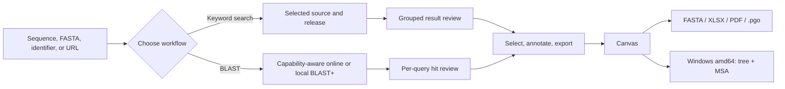

# phytozome GO

<p align="center">
  
</p>

<p align="center">
  <a href="https://github.com/KiriKirby/phytozome-go/releases"></a>
  <a href="LICENSE"></a>
  <a href="https://go.dev/"></a>
  <a href="https://kirikirby.github.io/phytozome-go/dc.html"></a>
</p>

**phytozome GO** is a terminal-native research workbench for finding, comparing,
curating, and exporting plant gene and sequence records. It joins source-aware
keyword search, BLAST, result review, local annotation-aware identifier handling,
Canvas curation, and optional phylogenetic-tree and multiple-sequence-alignment
work into one reproducible desktop workflow.

It is designed for a common comparative-genomics path: start from a gene,
protein, FASTA record, or source URL; find candidate records in a selected
database release; review evidence in tables; export data and sequences; and carry
the selected records into a Canvas for further analysis. The interface is a TUI
(terminal user interface), with local browser pages used where an interactive tree
or alignment viewer is the appropriate tool.

> **Scope notice.** phytozome GO is an independent open-source client. It is not
> affiliated with or endorsed by Phytozome, JGI, lemna.org, TAIR, NCBI, PLAZA,
> UniProt, InterPro, MEGA, Jalview, or any other data/service provider.

## Contents

- [Why phytozome GO](#why-phytozome-go)
- [Core capabilities](#core-capabilities)
- [Supported sources and provenance](#supported-sources-and-provenance)
- [Install and launch](#install-and-launch)
- [Quick start](#quick-start)
- [Scientific workflow](#scientific-workflow)
- [Outputs and reproducibility](#outputs-and-reproducibility)
- [Platform support and requirements](#platform-support-and-requirements)
- [Documentation](#documentation)
- [Development](#development)
- [Citation](#citation)
- [License and third-party components](#license-and-third-party-components)

## Why phytozome GO

Comparative sequence work often spans sources with different release policies,
identifier systems, query capabilities, and data-download layouts. A browser-only
workflow makes it easy to lose the selected release, source fields, input order,
or the exact subset exported for follow-up analysis.

phytozome GO provides:

- one interactive workflow for keyword search, BLAST, result selection, and
  export;
- source- and release-aware retrieval rather than hidden cross-source fallback;
- grouped result review that preserves original input terms and multi-query BLAST
  context;
- a local, validated Symbol Name database for alias ranking without submitting
  identifiers to a separate name-matching service;
- cached downloads, request coalescing, and bounded concurrency for practical
  work with remote biological data services;
- portable exports and `.pgo` snapshots that preserve work already performed.

The program does not claim that sequence similarity, a symbol alias, or an
automatically selected row establishes orthology, gene family membership, or
biological function. Those remain research decisions that require source-aware
interpretation and appropriate downstream validation.

## Core capabilities

| Area | What phytozome GO provides |
| --- | --- |
| **Keyword search** | Batched, grouped search for identifiers, loci, symbols, and annotations; source-specific exact, wide, and broad paths; row details; selection; and source-aware provenance. |
| **BLAST** | `blastn`, `blastx`, `tblastn`, and `blastp` when supported by the selected target; online-first execution where reliable; selected-release local BLAST+ fallback when official FASTA is available. |
| **Result review** | Selectable keyword and BLAST tables, multi-run BLAST review, detailed fields, complete aliases in details/exports, and biologically explicit identifiers. |
| **Symbol names** | Validated prebuilt `symbolname.pgd` installation and local alias ranking from structured source metadata. A missing match remains blank; the application does not invent a name. |
| **Canvas** | A curated sequence workspace combining FASTA imports, keyword rows, and BLAST rows for export, tree analysis, and MSA. |
| **Phylogenetics** | Windows-amd64 system-tree workflow using the bundled `mega-phgo-runtime`, with MEGA-backed alignment/inference, Reactree preview, and shared Canvas state. |
| **MSA** | A local JalviewJS-based alignment workspace after a successful Canvas tree refresh, with durable MSA state and PHgo-owned SVG/PNG/PDF image export. |
| **Reproducibility** | XLSX, FASTA, PDF report, and `.pgo` session-snapshot output; snapshots preserve workflow state and selected generated artifacts rather than silently rerunning a search. |

## Supported sources and provenance

The selected database and release are part of the result context. phytozome GO
does not silently replace a selected versioned release with a different source
when a lookup fails.

| Source path | Current role |
| --- | --- |
| **Phytozome** | Primary source-backed keyword and sequence workflows. Provider-specific acquisition/parsing is isolated from the shared workflow. |
| **lemna.org** | Download-backed species/release discovery, GFF3/AHRD/FASTA keyword workflow, and capability-aware BLAST. The public `download/` releases are authoritative; the homepage is used only to identify official clones. |
| **TAIR** | Selected-release Arabidopsis workflows. Versioned keyword, sequence, and local-BLAST work uses only the configured official assets for that release. TAIR12 follows its documented ENA project path; unavailable bulk assets remain unavailable rather than being substituted. |
| **NCBI and PLAZA** | Source-specific paths support documented NCBI search types and PLAZA Gene locus priority. PLAZA results retain `plaza_*` provenance and are identified as PLAZA-derived. |

External references can enrich a result, but the primary source database remains
visible in `source_database`. A row-level report URL is stored only when the
source supplied that exact row URL; the application does not generate a plausible
web URL from an identifier.

### Identifier and alias policy

`geneid`, `protein_id`, and transcript identifiers are distinct biological fields
and are presented as such. `phgo_alias` is the ranked alias list produced by the
local Symbol Name system; it is not the source database's raw `alias`, `symbols`,
or `synonyms` field. Table cells abbreviate long alias lists for readability, but
details, reports, snapshots, and exports retain full stored values.

## Install and launch

### Recommended installation: release bundle

Download the archive for your platform from
[GitHub Releases](https://github.com/KiriKirby/phytozome-go/releases), extract
the **entire** bundle to a writable local directory, and launch it from there.
Do not run the executable directly from an archive or separate it from its
companion files.

| Platform | Release bundle | Launch |
| --- | --- | --- |
| Windows amd64 | `phytozome-go_windows_amd64_wezterm.zip` | Run `phytozome-go.exe`. |
| Linux amd64 | `phytozome-go_linux_amd64_wezterm.tar.gz` | Run `./phytozome-go` from the extracted bundle. |
| macOS Intel | `phytozome-go_macos_amd64_wezterm.tar.gz` | Open `phytozome GO.app`. |
| macOS Apple Silicon | `phytozome-go_macos_arm64_wezterm.tar.gz` | Open `phytozome GO.app`. |

Reserve at least **50 GB** of free local storage if you expect to install the
Symbol Name database, cache source releases, build local BLAST databases, or keep
tree artifacts. A fast local disk is strongly recommended. On Windows, create a
shortcut to the executable if desired, but leave the bundle directory intact.

At packaged startup, the helper initializes the application-local cache, can
check GitHub Releases for an updated bundle, and can offer the prebuilt Symbol
Name database. Updates require consent; accepted updates preserve user output and
validate the replacement bundle before relaunching.

### Command-line entry points

The normal launch opens the interactive TUI. The executable also supports:

```text
phytozome-go version
phytozome-go blast plan
phytozome-go blast wizard
```

Use `phytozome-go --help` for the currently compiled command summary.

### Network access

Release checks, source metadata, optional components, and public biological data
depend on their respective upstream services. Use a reliable, lawful network path
that can reach those services. In networks where GitHub or a selected provider is
inaccessible, including some networks in mainland China, restore access before
retrying; do not disable certificate validation.

## Quick start

### 1. Start a keyword-search workflow

1. Launch phytozome GO and select a source and, when requested, a species/release.
2. Open **Keyword Search**.
3. Select the appropriate search type, then enter one identifier, locus, symbol,
   or annotation term per line.
4. Run a precise search when you expect a defined identifier match. Choose Wide
   or Broad search explicitly when you need a source-defined discovery path.
5. Inspect row details, select candidate rows, and export them or send the rows
   with resolved sequences to BLAST or Canvas.

Precise search does not silently widen itself after a no-result outcome. This
keeps negative results interpretable and makes broader search an explicit choice.

### 2. Start a BLAST workflow

1. Open **BLAST** and choose the target source/species/release.
2. Paste a sequence, one or more FASTA records, supported source/report URLs, or
   eligible rows transferred from Keyword Search.
3. Choose a valid query/database combination:

   | Query | Target database | Program |
   | --- | --- | --- |
   | Nucleotide | Nucleotide | `blastn` |
   | Nucleotide | Protein | `blastx` |
   | Protein | Nucleotide | `tblastn` |
   | Protein | Protein | `blastp` |

4. Run the shown online path when available. When a reliable server path is not
   available, install/allow the prompted BLAST+ component to use the matching
   official local FASTA fallback.
5. Review each query run, inspect hit details, select rows, and export the current
   table or all original query runs as appropriate.

For a multi-query workflow, review/export remains multi-run even if filtering or
family merging leaves one visible table. Query labels describe query sources;
each hit retains its own independent label information.

### 3. Curate and explore in Canvas

Add selected keyword/BLAST rows or FASTA records to **Canvas**. Canvas maintains
the source context, sequence availability, selection state, and display names.
Export selected rows as FASTA or save a `.pgo` snapshot. On Windows amd64, open
the system-tree panel, choose a target/method, and refresh to generate a shared
tree and MSA payload for the local browser viewers.

## Scientific workflow


```mermaid
flowchart LR
    A[Sequence, FASTA, identifier, or URL] --> B{Choose workflow}
    B -->|Keyword search| C[Selected source and release]
    B -->|BLAST| D[Capability-aware online or local BLAST+]
    C --> E[Grouped result review]
    D --> F[Per-query hit review]
    E --> G[Select, annotate, export]
    F --> G
    G --> H[Canvas]
    H --> I[FASTA / XLSX / PDF / .pgo]
    H --> J[Windows amd64: tree + MSA]
```

### Local BLAST behavior

Local BLAST is a fallback, not a hidden replacement for a usable online path. The
application downloads the compatible official FASTA for the selected release,
creates/reuses a local database, runs the appropriate BLAST+ command, parses the
result, and reports the active phase. It does not construct a target database by
borrowing FASTA from a different source or release.

### Symbol Name database behavior

`symbolname.pgd` is a local prebuilt database distributed through a manifest and
release assets from the dedicated
[symbol-name database repository](https://github.com/KiriKirby/phytozome-go-symbolname-db).
Installation stages parts locally, reassembles/decompresses them, and validates
the resulting database. It is not built from NCBI source files on an end-user
machine. Automatic name workflows show progress and report install failures
instead of silently applying a heuristic fallback.

### Tree and MSA behavior

The system-tree workflow is intentionally bounded:

- it is supported by the packaged **Windows amd64** release only;
- it uses the bundled `mega-phgo-runtime` and its runtime-owned MUSCLE binary,
  never an arbitrary system `PATH` installation;
- protein mode exposes protein ClustalW/MUSCLE methods; DNA mode exposes DNA and
  codon ClustalW/MUSCLE methods;
- phytozome GO does not reverse-translate, infer sequence type from letters, or
  biologically repair input before the runtime executes it;
- Reactree owns tree rendering and interaction; the MSA viewer is a local
  JalviewJS workspace backed by the shared Canvas artifacts.

On Linux and macOS, system-tree computation reports unsupported rather than
downloading a substitute runtime. Wine may be used independently to run the
complete Windows release; see the [Wine User's Guide](https://wiki.winehq.org/Wine_User%27s_Guide).

## Outputs and reproducibility

The export flow opens a system folder picker where available and otherwise uses
an `output/` directory beside the executable. An extra export folder name is a
subfolder of the chosen location, not a forced location elsewhere on the system.

| Output | Purpose |
| --- | --- |
| **XLSX** | Selected rows, complete available columns, source metadata, and workflow-specific context. |
| **FASTA** | Selected resolved sequences using the chosen header style. Generated headers contain no whitespace, tabs, or line breaks. |
| **PDF** | Analysis/report output for supported result workflows. |
| **`.pgo`** | A compressed, versioned session snapshot for resuming review/export without rerunning saved work. |
| **SVG / PNG / PDF** | Data-driven MSA image output from the Canvas MSA export workflow. |

Snapshots preserve durable workflow context, result rows, review state,
selections, cached sequence data needed for later work, and explicitly selected
artifacts. They do not preserve incidental UI state such as open menus, scroll
offsets, or browser viewport position. Reopening a snapshot does not rerun a
search or BLAST job unless a later user action requires new work.

### Local files and cache policy

All managed runtime artifacts stay next to the application bundle:

```text
output/       default export destination
.cache/       source caches, downloaded assets, local BLAST DBs, tree artifacts
blastplus/    managed BLAST+ component when required
```

The cache can be regenerated, but deleting it removes installed/downloaded data
and prepared local BLAST assets. Preserve outputs and `.pgo` snapshots before any
manual cache cleanup.

## Platform support and requirements

| Capability | Windows amd64 | Linux amd64 | macOS Intel / Apple Silicon |
| --- | :---: | :---: | :---: |
| Interactive TUI and source workflows | ✓ | ✓ | ✓ |
| Keyword search, result review, exports, snapshots | ✓ | ✓ | ✓ |
| On-demand BLAST+ workflow when supported by bundle/source | ✓ | ✓ | ✓ |
| Canvas system-tree computation | ✓ | — | — |
| Local Reactree/JalviewJS browser viewers after supported refresh | ✓ | platform-dependent viewer use | platform-dependent viewer use |

The platform table describes the project boundary, not upstream-service
availability. A database/source may still lack an asset or server capability for
a specific release and query/program combination.

## Documentation

The [Documentation Center](https://kirikirby.github.io/phytozome-go/dc.html)
contains user-focused reference articles for installation, updates, keyword
search, BLAST, result tables, exports, sessions, Canvas, trees, and MSA.

Repository design documentation is organized under [`doc2/`](doc2/):

- [Main interface design index](doc2/main-interface-redesign/README.md)
- [Phylogenetic tree system](doc2/phylogenetic-tree/README.md)
- [Session snapshot system](doc2/session-snapshot-system.md)
- [FASTA export headers](doc2/fasta-export-headers.md)

For source behavior, start with the Documentation Center's
[Keyword connector reference](docs/dc/keyword-connectors.html) and
[BLAST connector reference](docs/dc/blast-connectors.html).

## Development

### Prerequisites

- Go **1.26.3** (the version declared by `go.mod`)
- Git
- PowerShell on Windows for the supplied packaging scripts
- Node.js only when regenerating static Documentation Center pages

### Build and validate

```powershell
# Run the repository-wide Go checks.
go test ./...
go vet ./...
go build ./...

# Windows development bundle and tests (writes only beneath bin\).
powershell -ExecutionPolicy Bypass -File .\scripts\build-codex.ps1

# Full cross-platform release packaging.
powershell -ExecutionPolicy Bypass -File .\scripts\build-codex.ps1 -Publish
```

`-Publish` is a release operation. It expects a clean worktree and prepares
Windows, Linux, and macOS release archives; use it only when publishing a
release. See the scripts themselves for the complete set of release parameters.

### Documentation Center maintenance

Topic pages use the legacy static website layout deliberately. Update
[`docs/dc/generate-docs.js`](docs/dc/generate-docs.js), then regenerate:

```text
node docs/dc/generate-docs.js
```

The content model and writing contract are in
[`docs/dc/CONTENT_MODEL.md`](docs/dc/CONTENT_MODEL.md). Check internal links and
run `git diff --check` before committing generated pages.

### Contributing

Contributions should preserve source/release provenance, avoid undocumented
cross-source fallbacks, and include proportionate tests. Please open an issue or
discussion before a large workflow, data-source, snapshot-format, or tree-runtime
change so the implementation and its design documentation can evolve together.

Do not commit runtime caches, release archives, downloaded source assets, or
private biological data. Keep generated build artifacts under `bin/` and user
exports outside the source tree.

## Citation

If phytozome GO contributes to published work, cite the release used and the
repository commit or archive. A machine-readable citation record is provided in
[`CITATION.cff`](CITATION.cff).

```text
Wang S. phytozome GO: a terminal-native workbench for source-aware plant
gene and sequence workflows. Version <version used>. 2026.
https://github.com/KiriKirby/phytozome-go
```

Also cite the original data resources and analysis software used in your work,
including the selected source/release and any relevant BLAST+, MEGA, Jalview,
UniProt, InterPro, NCBI, TAIR, PLAZA, Phytozome, or lemna.org references. The
application's output provenance helps identify those dependencies; it does not
replace the providers' required citations or terms of use.

## License and third-party components

This repository is licensed under the
[Common Public Attribution License 1.0 (CPAL-1.0)](LICENSE). Review the license
before redistributing modified or bundled versions.

phytozome GO interoperates with or bundles components subject to their own terms,
including NCBI BLAST+, the MEGA-derived PHgo runtime, MUSCLE, Reactree, and
JalviewJS. Upstream biological data, website content, and APIs remain governed by
their respective providers' access, attribution, and redistribution policies.

## Acknowledgements

phytozome GO depends on the scientific software, public databases, and open-source
libraries named above. We thank the maintainers and data curators whose work makes
reproducible plant comparative-genomics workflows possible.
